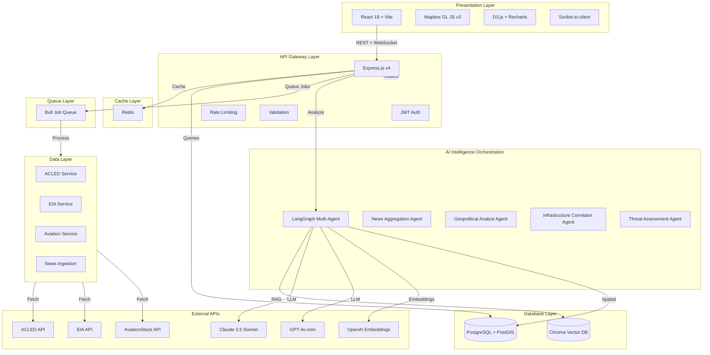
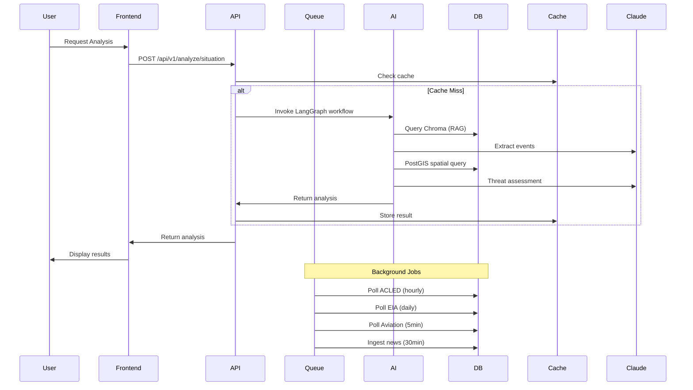
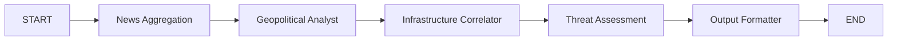
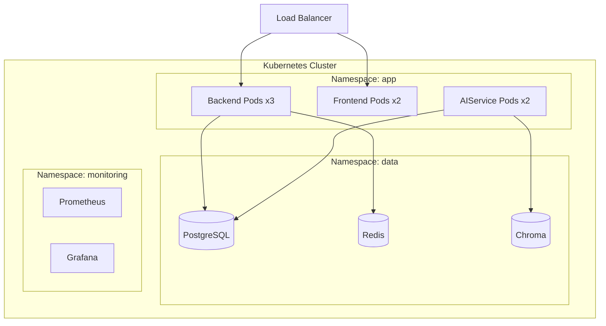

# Situational Awareness MVP - Architecture Diagram

## System Overview

## Data Flow

## LangGraph Workflow

## Component Breakdown

### Frontend Components
- DashboardContainer (main layout)
- ThreatGauge (real-time threat level)
- EventTimeline (geopolitical events)
- InfrastructureRiskMap (Mapbox correlations)
- NewsIntelligence (AI-analyzed articles)
- RecommendationsPanel (AI suggestions)
- AnalysisMetadata (tokens, cost, time)

### Backend Services
- ACLEDService (conflict data)
- EIAService (energy data)
- AviationService (flight data)
- CacheService (Redis operations)
- CorrelationService (spatial analysis)

### AI Agents
- News Aggregation Agent (RAG + Chroma)
- Geopolitical Analyst Agent (Claude 3.5 extraction)
- Infrastructure Correlator Agent (PostGIS spatial)
- Threat Assessment Agent (synthesis)

## Infrastructure

